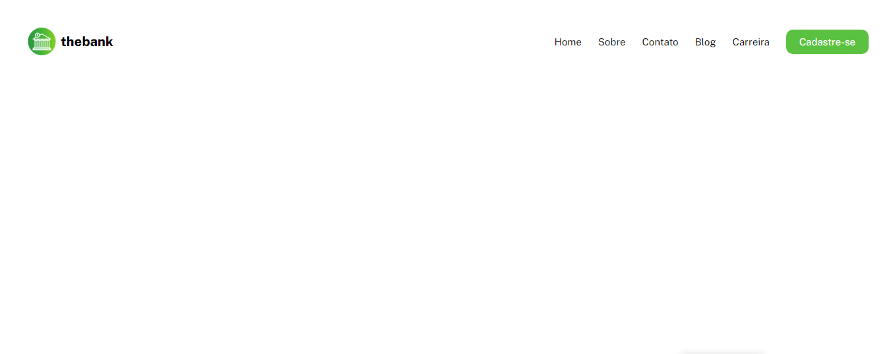
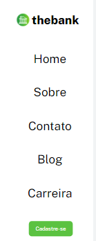

# Menu Com Flexbox
Projeto para treinar a criação de um cabeçalho com menu, sendo usado em um suposto site de um banco! 🚀

[](https://google.com)

[](https://google.com)

## Tecnologias Utilizadas
- HTML
- CSS

## Como Utilizar

1 - Clone o projeto
```
git clone <url>
```

2 - Acesse a pasta do projeto

```
cd 06-menu-com-flexbox
```